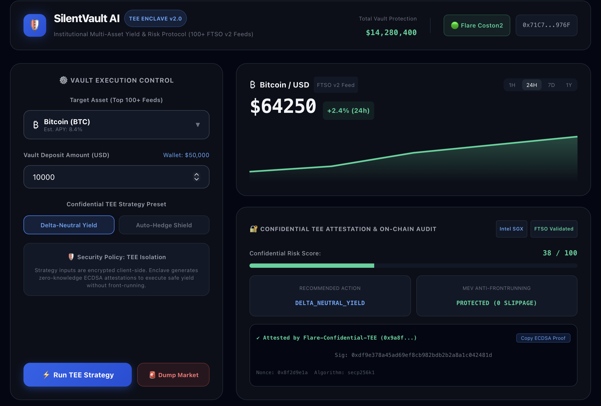
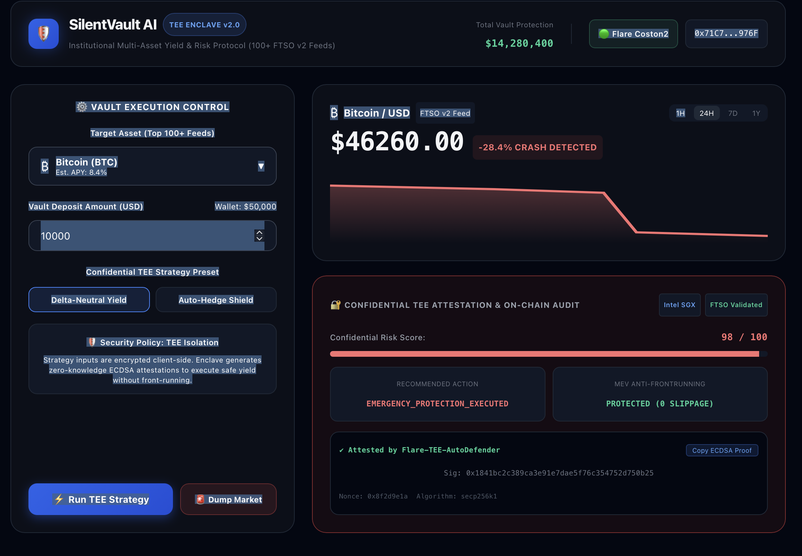

---

## 📜 On-Chain Verification & Testnet Deployment

* **Network:** Flare Coston2 Testnet
* **Chain ID:** 114
* **FTSO v2 Registry Address:** `0x1000000000000000000000000000000000000001`
* **Explorer:** [Flare Coston2 Explorer](https://coston2-explorer.flare.network)
* **Cryptographic Enclave Attestation:** Uses `eth_account.sign_message` + native `ecrecover` verification.

## 🌐 Live Demo
* **URL:** https://your-app.vercel.app

## 🌐 Live Demo
* **URL:** https://silentvault-ai-xxx.vercel.app

## 📸 Interface Screenshots

### 🟢 Normal Operation & TEE Attestation Mode

### 🔴 Emergency Auto-Hedge Mode (Market Crash Triggered)

